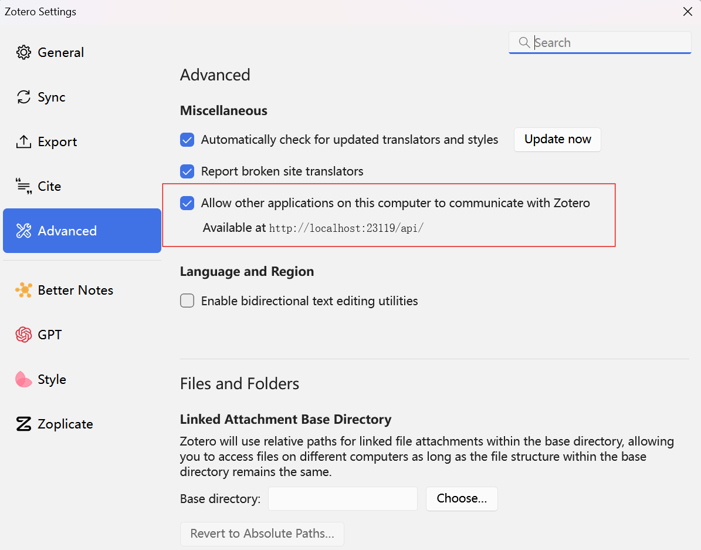

# Zotero Local API

[](https://python.org)
[](https://opensource.org/licenses/MIT)
[](https://pypi.org/project/zoteroapi/)

这是一个用于访问本地 Zotero 服务器 API 的 Python 客户端库。它提供了简洁易用的接口来管理学术文献、集合、笔记和文件。

## ✨ 特性

- 🔍 **强大的搜索功能** - 支持关键词、DOI、PMID 和标题搜索
- 📁 **完整的文件管理** - 下载、上传附件文件
- 📝 **笔记操作** - 管理和操作文献笔记
- 🏷️ **标签管理** - 标签的增删改查
- 🔧 **易于使用** - 简洁的 API 设计和丰富的示例
- 📚 **完善的文档** - 中文文档和详细的 API 参考
- 🧪 **充分测试** - 88%+ 的代码覆盖率

## 📦 安装

```bash
pip install zoteroapi
```

或者从源码安装：

```bash
git clone https://github.com/yourusername/zoteroapi.git
cd zoteroapi
pip install -e .
```

## 🚀 快速开始

### 基本用法

```python
from zoteroapi import ZoteroLocal

# 创建客户端实例
client = ZoteroLocal()

# 获取最近的前 10 篇文献
items = client.get_items_top(limit=10)
for item in items:
    print(f"标题: {item['data']['title']}")

# 搜索文献
results = client.search_items("machine learning")
print(f"找到 {len(results)} 篇相关文献")

# 获取所有文献集
collections = client.get_collections()
for collection in collections:
    print(f"文献集: {collection['data']['name']}")
```

### 错误处理

```python
from zoteroapi import ZoteroLocalError, ResourceNotFound

try:
    item = client.get_item("ABC123XYZ")
    print(item['data']['title'])
except ResourceNotFound:
    print("文献条目不存在")
except ZoteroLocalError as e:
    print(f"API 错误: {e}")
```

## ⚙️ Zotero 本地服务器配置

在开始使用之前，需要确保 Zotero 本地服务器已启用：

1. 打开 Zotero 桌面应用
2. 进入 **编辑 → 首选项 → 高级**
3. 点击 **配置编辑器**
4. 搜索 `extensions.zotero.httpServer.enabled`
5. 将其值设置为 `true`
6. 重启 Zotero



默认配置：
- 端口：`23119`
- URL：`http://localhost:23119/api/users/000000/`

## 📖 详细文档

- 📚 [完整文档](https://yourusername.github.io/zoteroapi/)
- 🚀 [快速开始](docs/getting-started/quick-start.md)
- 📋 [API 参考](docs/api-reference/)
- 💡 [使用示例](docs/examples/)
- 🛠️ [开发指南](docs/development/)

## 🔧 开发

### 安装开发依赖

```bash
pip install -e ".[test,docs]"
```

### 运行测试

```bash
pytest
```

### 构建文档

```bash
mkdocs serve  # 本地预览
mkdocs build  # 构建静态文件
```

## 📋 API 参考

### 主要方法

- `get_items_top(limit=10)` - 获取顶层文献条目
- `get_item(item_key)` - 获取单个文献条目
- `search_items(query)` - 关键词搜索
- `search_by_doi(doi)` - DOI 搜索
- `search_by_pmid(pmid)` - PMID 搜索
- `get_collections()` - 获取所有文献集
- `get_collection_items(collection_key)` - 获取文献集中的条目
- `get_tags()` - 获取所有标签
- `download_file(item_key, path)` - 下载附件文件
- `upload_file(file_path, parent_item)` - 上传文件

### Mixin 类

- **SearchMixin** - 搜索功能
- **FilesMixin** - 文件操作
- **NotesMixin** - 笔记管理

## 🤝 贡献

欢迎贡献代码！请查看 [贡献指南](docs/development/contributing.md) 了解详细信息。

## 📄 许可证

本项目采用 MIT 许可证 - 查看 [LICENSE](LICENSE) 文件了解详情。

## 🆘 支持

- 📖 [文档](https://yourusername.github.io/zoteroapi/)
- 🐛 [问题反馈](https://github.com/yourusername/zoteroapi/issues)
- 💬 [讨论区](https://github.com/yourusername/zoteroapi/discussions)

## 🎯 路线图

- [ ] 添加更多 Zotero API 功能
- [ ] 支持批量操作
- [ ] 添加异步支持
- [ ] 完善错误恢复机制