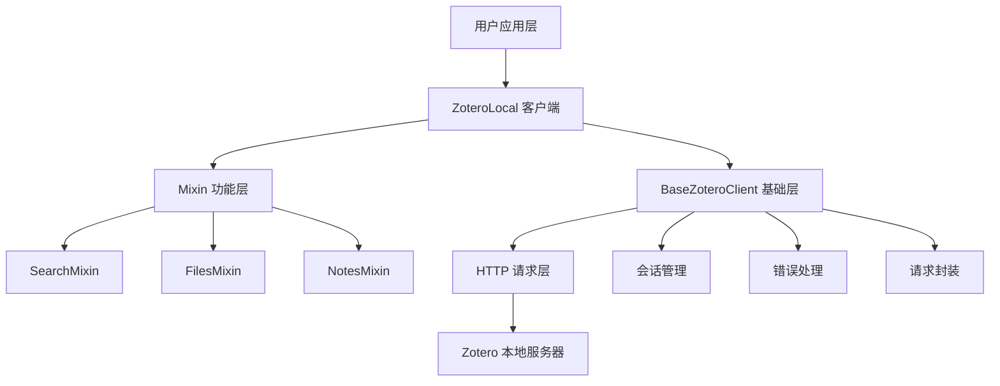
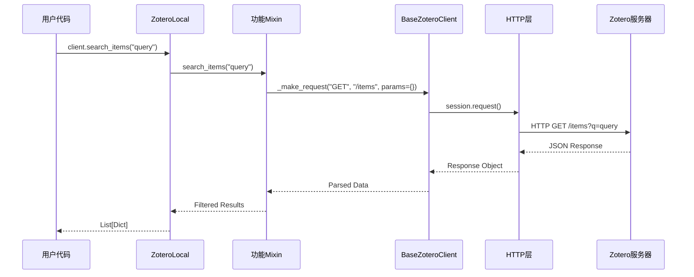
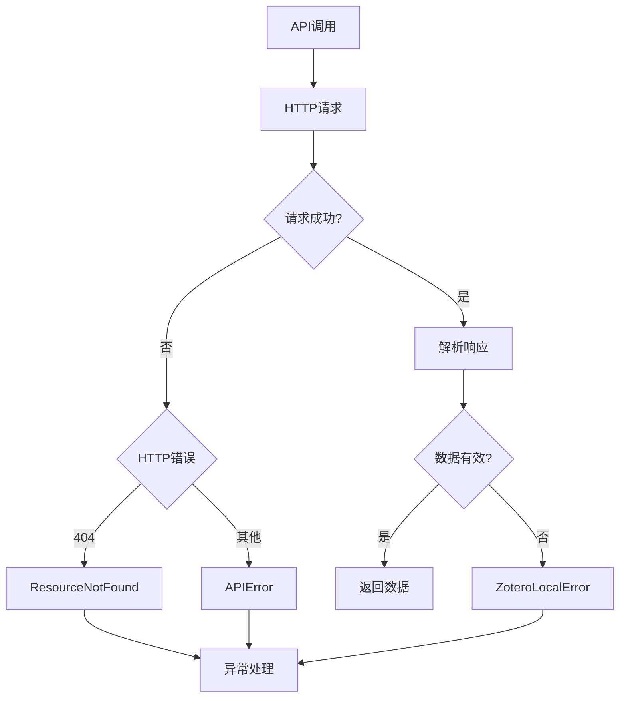

# 架构设计

本文档详细描述 ZoteroAPI 项目的架构设计、设计原则和技术实现。

## 总体架构

ZoteroAPI 采用分层架构设计，将功能划分为清晰的层次，每个层次负责特定的职责。



## 设计原则

### 1. 单一职责原则 (SRP)

每个类和模块都有明确的单一职责：

- **BaseZoteroClient**: 只负责 HTTP 通信和基础请求处理
- **SearchMixin**: 只负责搜索相关功能
- **FilesMixin**: 只负责文件操作功能
- **NotesMixin**: 只负责笔记管理功能
- **ZoteroLocal**: 整合所有功能，提供统一接口

### 2. 开放封闭原则 (OCP)

系统对扩展开放，对修改封闭：

- 通过 Mixin 模式可以轻松添加新功能
- 不需要修改现有代码即可扩展功能
- 新功能通过继承现有类实现

### 3. 依赖倒置原则 (DIP)

高层模块不依赖低层模块，都依赖于抽象：

- ZoteroLocal 依赖抽象的 Mixin 接口
- BaseZoteroClient 提供抽象的 HTTP 接口
- 通过依赖注入实现松耦合

### 4. 接口隔离原则 (ISP)

客户端不应该依赖它不需要的接口：

- 每个 Mixin 提供特定的功能接口
- 用户可以只使用需要的功能模块
- 避免接口污染和强制依赖

## 核心组件架构

### BaseZoteroClient - 基础通信层

```python
class BaseZoteroClient:
    """
    基础 HTTP 客户端

    职责：
    - HTTP 会话管理
    - 请求/响应处理
    - 错误处理
    - 连接复用
    """

    def __init__(self, base_url: str):
        self.base_url = base_url.rstrip('/')
        self._session = requests.Session()  # 连接复用
        self._cache = {}  # 可选缓存

    def _make_request(self, method: str, endpoint: str, **kwargs):
        """统一的请求处理方法"""

    def _request(self, method: str, path: str, **kwargs):
        """高级请求方法，包含错误处理"""
```

**设计特点**：

1. **连接复用**: 使用 `requests.Session` 复用 HTTP 连接
2. **统一接口**: 提供统一的请求处理接口
3. **错误封装**: 将 HTTP 错误转换为业务异常
4. **配置灵活**: 支持自定义 base_url 和其他配置

### Mixin 模式 - 功能模块化

```python
# Mixin 基类
class BaseMixin:
    """所有 Mixin 的基类"""

    def _validate_params(self, **kwargs):
        """参数验证"""
        pass

# 具体实现
class SearchMixin(BaseMixin):
    """搜索功能模块"""

    def search_items(self, query: str) -> List[Dict]:
        """搜索文献"""

class FilesMixin(BaseMixin):
    """文件操作模块"""

    def get_item_file(self, item_key: str) -> BinaryIO:
        """获取附件文件"""

class NotesMixin(BaseMixin):
    """笔记管理模块"""

    def get_item_notes(self, item_key: str) -> List[Dict]:
        """获取文献笔记"""
```

**Mixin 模式优势**：

1. **功能分离**: 每个功能模块独立开发和测试
2. **灵活组合**: 可以选择性使用功能模块
3. **易于扩展**: 添加新功能不需要修改现有代码
4. **代码复用**: Mixin 可以在多个类中复用

### ZoteroLocal - 统一接口层

```python
class ZoteroLocal(BaseZoteroClient, SearchMixin, FilesMixin, NotesMixin):
    """
    主要客户端类

    组合所有 Mixin 功能，提供统一的 API 接口
    """

    def __init__(self, base_url: str = DEFAULT_URL):
        super().__init__(base_url)
        # 初始化 Mixin 需要的资源
        self._init_mixins()

    # 基础文献操作
    def get_item(self, item_key: str) -> Dict:
        """获取单个文献"""

    def get_items(self, limit: int = None) -> List[Dict]:
        """获取文献列表"""

    # Mixin 功能通过多重继承自动可用
    # search_items() 来自 SearchMixin
    # get_item_file() 来自 FilesMixin
    # get_item_notes() 来自 NotesMixin
```

## 数据流架构

### 请求处理流程



### 错误处理流程



## 异常处理架构

### 异常层次结构

```python
class ZoteroLocalError(Exception):
    """基础异常类"""
    pass

class ConnectionError(ZoteroLocalError):
    """连接相关异常"""
    pass

class APIError(ZoteroLocalError):
    """API调用异常"""
    pass

class ResourceNotFound(ZoteroLocalError):
    """资源不存在异常"""
    pass
```

### 错误处理策略

1. **分层处理**: 不同层次的错误进行不同级别的处理
2. **异常链**: 保持原始异常信息，便于调试
3. **用户友好**: 提供清晰的错误信息和建议
4. **恢复机制**: 对可恢复错误提供重试机制

```python
def _handle_http_error(self, response):
    """HTTP 错误处理"""
    status_code = response.status_code

    if status_code == 404:
        raise ResourceNotFound(f"Resource not found: {response.url}")
    elif status_code >= 500:
        raise APIError(f"Server error: {status_code}")
    elif status_code >= 400:
        raise APIError(f"Client error: {status_code}")
    else:
        raise ZoteroLocalError(f"Unexpected error: {status_code}")
```

## 缓存架构

### 缓存策略

```python
class CacheManager:
    """缓存管理器"""

    def __init__(self, ttl: int = 300):
        self._cache = {}
        self._timestamps = {}
        self.ttl = ttl

    def get(self, key: str):
        """获取缓存"""
        if self._is_expired(key):
            self._remove(key)
            return None
        return self._cache.get(key)

    def set(self, key: str, value):
        """设置缓存"""
        self._cache[key] = value
        self._timestamps[key] = time.time()

    def _is_expired(self, key: str):
        """检查缓存是否过期"""
        timestamp = self._timestamps.get(key, 0)
        return time.time() - timestamp > self.ttl
```

### 缓存应用场景

1. **文献元数据**: 缓存常用的文献信息
2. **搜索结果**: 缓存搜索结果减少重复查询
3. **配置信息**: 缓存配置和设置信息
4. **会话信息**: 缓存会话状态和认证信息

## 配置管理架构

### 配置层次

```python
class Configuration:
    """配置管理"""

    # 默认配置
    DEFAULT_CONFIG = {
        'base_url': 'http://localhost:23119/api/users/000000/',
        'timeout': 30,
        'retry_count': 3,
        'cache_ttl': 300
    }

    # 用户配置
    USER_CONFIG = {}

    # 环境配置
    ENV_CONFIG = {}

    @classmethod
    def get_config(cls, key: str, default=None):
        """获取配置值"""
        # 优先级: 用户配置 > 环境配置 > 默认配置
        return (cls.USER_CONFIG.get(key) or
                cls.ENV_CONFIG.get(key) or
                cls.DEFAULT_CONFIG.get(key, default))
```

### 配置来源

1. **默认配置**: 代码中的默认值
2. **环境变量**: 从环境变量读取配置
3. **配置文件**: 从配置文件读取
4. **运行时设置**: 代码运行时设置

## 插件架构

### 插件接口设计

```python
class PluginInterface:
    """插件接口"""

    def initialize(self, client):
        """插件初始化"""
        pass

    def before_request(self, method: str, endpoint: str, **kwargs):
        """请求前钩子"""
        pass

    def after_response(self, response, method: str, endpoint: str):
        """响应后钩子"""
        pass

class PluginManager:
    """插件管理器"""

    def __init__(self):
        self.plugins = []

    def register_plugin(self, plugin: PluginInterface):
        """注册插件"""
        self.plugins.append(plugin)

    def execute_before_hooks(self, method: str, endpoint: str, **kwargs):
        """执行请求前钩子"""
        for plugin in self.plugins:
            plugin.before_request(method, endpoint, **kwargs)

    def execute_after_hooks(self, response, method: str, endpoint: str):
        """执行响应后钩子"""
        for plugin in self.plugins:
            plugin.after_response(response, method, endpoint)
```

### 插件应用场景

1. **日志插件**: 记录 API 调用日志
2. **缓存插件**: 自定义缓存策略
3. **监控插件**: 性能监控和统计
4. **转换插件**: 响应数据转换
5. **验证插件**: 请求参数验证

## 扩展机制

### 功能扩展

```python
# 1. 添加新的 Mixin
class CitationMixin(BaseMixin):
    """文献引用功能"""

    def format_citation(self, item_key: str, style: str = "apa"):
        """格式化文献引用"""
        pass

# 2. 扩展现有客户端
class ExtendedZoteroClient(ZoteroLocal, CitationMixin):
    """扩展的 Zotero 客户端"""
    pass

# 3. 动态添加功能
def add_citation_support(client):
    """动态添加引用功能"""
    client.__class__ = type(
        'ExtendedClient',
        (client.__class__, CitationMixin),
        {}
    )
```

### 协议扩展

```python
class ProtocolAdapter:
    """协议适配器"""

    def __init__(self, protocol_version: str = "v3"):
        self.protocol_version = protocol_version

    def adapt_request(self, request_data):
        """适配请求数据"""
        if self.protocol_version == "v3":
            return self._adapt_to_v3(request_data)
        else:
            return request_data

    def adapt_response(self, response_data):
        """适配响应数据"""
        if self.protocol_version == "v3":
            return self._adapt_from_v3(response_data)
        else:
            return response_data
```

## 性能优化架构

### 连接池管理

```python
class ConnectionPoolManager:
    """连接池管理"""

    def __init__(self, pool_size=10, max_retries=3):
        self.session = requests.Session()

        # 配置连接池
        adapter = requests.adapters.HTTPAdapter(
            pool_connections=pool_size,
            pool_maxsize=pool_size,
            max_retries=max_retries
        )

        self.session.mount('http://', adapter)
        self.session.mount('https://', adapter)
```

### 异步支持架构

```python
import asyncio
import aiohttp
from typing import Optional, List, Dict

class AsyncZoteroClient:
    """异步 Zotero 客户端"""

    def __init__(self, base_url: str):
        self.base_url = base_url.rstrip('/')
        self._session = None

    async def __aenter__(self):
        self._session = aiohttp.ClientSession()
        return self

    async def __aexit__(self, exc_type, exc_val, exc_tb):
        if self._session:
            await self._session.close()

    async def get_item(self, item_key: str) -> Dict:
        """异步获取文献"""
        url = f"{self.base_url}/items/{item_key}"

        async with self._session.get(url) as response:
            response.raise_for_status()
            return await response.json()
```

## 监控和日志架构

### 监控指标

```python
class MetricsCollector:
    """指标收集器"""

    def __init__(self):
        self.request_count = 0
        self.response_times = []
        self.error_count = 0
        self.cache_hits = 0
        self.cache_misses = 0

    def record_request(self, duration: float, success: bool = True):
        """记录请求指标"""
        self.request_count += 1
        self.response_times.append(duration)

        if not success:
            self.error_count += 1

    def get_statistics(self) -> Dict:
        """获取统计信息"""
        return {
            'request_count': self.request_count,
            'error_count': self.error_count,
            'success_rate': (self.request_count - self.error_count) / max(self.request_count, 1),
            'average_response_time': sum(self.response_times) / max(len(self.response_times), 1),
            'cache_hit_rate': self.cache_hits / max(self.cache_hits + self.cache_misses, 1)
        }
```

### 日志架构

```python
class StructuredLogger:
    """结构化日志"""

    def __init__(self, name: str):
        self.logger = logging.getLogger(name)
        self._setup_logger()

    def _setup_logger(self):
        """设置日志器"""
        handler = logging.StreamHandler()
        formatter = logging.Formatter(
            '%(asctime)s - %(name)s - %(levelname)s - %(message)s'
        )
        handler.setFormatter(formatter)
        self.logger.addHandler(handler)
        self.logger.setLevel(logging.INFO)

    def log_request(self, method: str, url: str, duration: float):
        """记录请求日志"""
        self.logger.info(
            "API Request",
            extra={
                'method': method,
                'url': url,
                'duration': duration,
                'type': 'request'
            }
        )

    def log_error(self, error: Exception, context: str):
        """记录错误日志"""
        self.logger.error(
            f"Error in {context}: {str(error)}",
            extra={
                'error_type': type(error).__name__,
                'context': context,
                'type': 'error'
            },
            exc_info=True
        )
```

## 未来扩展方向

### 1. 多协议支持

- 支持 Zotero API v2/v4
- 支持其他文献管理器 API
- 统一的多客户端接口

### 2. 云端集成

- 支持 Zotero Web API
- 支持 WebDAV 同步
- 支持云端附件操作

### 3. 智能化功能

- 自动分类和标签
- 智能推荐系统
- 语义搜索

### 4. 可视化集成

- 文献关系图
- 统计图表
- 交互式界面

这种架构设计确保了 ZoteroAPI 项目的可维护性、可扩展性和性能，为未来的功能扩展提供了坚实的基础。