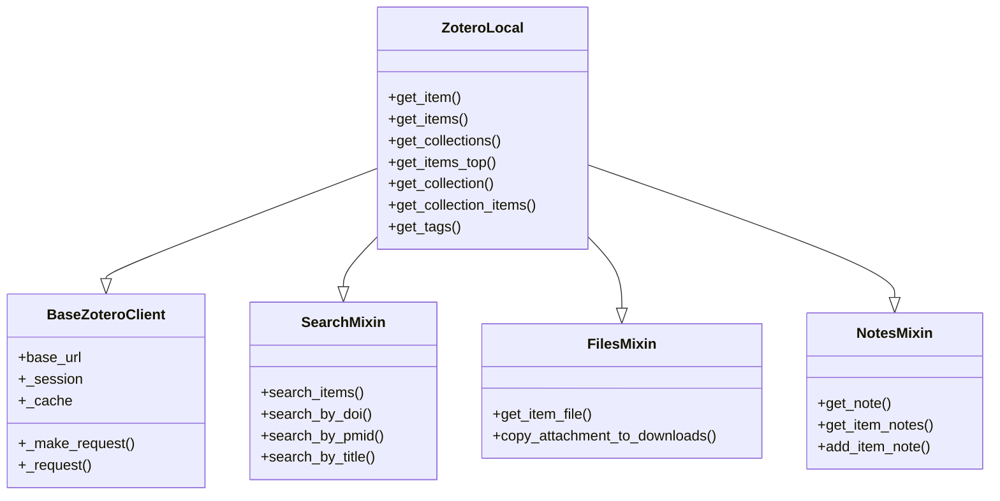

# 客户端初始化

本页面详细介绍如何初始化和配置 ZoteroAPI 客户端。

## 基本初始化

最简单的方式是使用默认配置初始化客户端：

```python
from zoteroapi import ZoteroLocal

# 使用默认配置初始化
client = ZoteroLocal()
```

这将连接到本地 Zotero 服务器的默认地址：`http://localhost:23119/api/users/000000/`

## 自定义配置

### 修改基础 URL

如果你的 Zotero 本地服务器使用了不同的端口或配置，可以自定义 `base_url`：

```python
# 使用自定义端口
client = ZoteroLocal(base_url="http://localhost:23120/api/users/000000/")

# 连接到远程 Zotero 服务器
client = ZoteroLocal(base_url="http://192.168.1.100:23119/api/users/000000/")
```

!!! warning "URL 格式说明"
    - URL 应包含完整的 API 路径：`/api/users/000000/`
    - 末尾的斜杠会被自动处理，加不加都可以
    - 用户 ID `000000` 是 Zotero 本地服务器的默认值

## 客户端架构

ZoteroLocal 客户端采用 Mixin 模式设计，整合了多个功能模块：



### 核心组件说明

| 组件 | 功能 |
|------|------|
| **BaseZoteroClient** | 基础 HTTP 客户端，处理请求、会话管理和缓存 |
| **SearchMixin** | 提供搜索相关功能（DOI、PMID、标题搜索等） |
| **FilesMixin** | 提供文件操作功能（上传、下载、复制附件） |
| **NotesMixin** | 提供笔记管理功能（创建、获取、管理笔记） |
| **ZoteroLocal** | 主客户端类，整合所有功能并提供文献管理方法 |

## 连接管理

### 会话复用

ZoteroLocal 内部使用 `requests.Session` 来复用 HTTP 连接，提高性能：

```python
client = ZoteroLocal()

# 所有请求会复用同一个会话
items = client.get_items_top(limit=10)
collections = client.get_collections()
# ... 更多请求
```

!!! tip "性能优化"
    会话复用可以减少 TCP 握手开销，特别是在频繁请求时效果明显。

### 缓存机制

客户端内置了简单的缓存机制：

```python
client = ZoteroLocal()

# 内部缓存存储在 client._cache 字典中
# 注意：当前版本的缓存机制主要用于内部状态管理
```

!!! note "缓存说明"
    当前版本的缓存机制比较基础，主要用于内部状态管理。如果需要高级缓存功能（如 TTL、LRU 等），建议在应用层实现。

## 错误处理

客户端初始化本身不会执行网络请求，因此不会抛出连接错误。错误通常在首次 API 调用时出现：

```python
from zoteroapi import ZoteroLocal, ZoteroLocalError

client = ZoteroLocal()

try:
    items = client.get_items_top(limit=10)
    print(f"成功获取 {len(items)} 篇文献")
except ZoteroLocalError as e:
    print(f"连接失败: {e}")
    print("请检查：")
    print("1. Zotero 是否正在运行")
    print("2. 本地服务器是否已启用")
    print("3. base_url 配置是否正确")
```

### 常见错误

#### 连接被拒绝

```python
# 错误示例
ZoteroLocalError: API request failed: HTTPConnectionPool(host='localhost', port=23119): 
Max retries exceeded with url: /api/users/000000/items/top?format=json&limit=10 
(Caused by NewConnectionError('<urllib3.connection.HTTPConnection object at 0x...>: 
Failed to establish a new connection: [Errno 61] Connection refused'))
```

**原因**：
- Zotero 未运行
- 本地服务器未启用
- 端口配置错误

**解决方案**：
1. 确保 Zotero 正在运行
2. 在 Zotero 设置中启用本地服务器（参见 [配置指南](../getting-started/configuration.md)）
3. 检查端口号是否正确

#### 404 错误

```python
# 错误示例
ResourceNotFound: Resource not found: http://localhost:23119/api/users/000000/items/INVALID_KEY
```

**原因**：请求的资源不存在（如无效的 item_key）

**解决方案**：检查 key 是否正确

## 使用示例

### 基础用法

```python
from zoteroapi import ZoteroLocal

# 初始化客户端
client = ZoteroLocal()

# 获取文献
items = client.get_items_top(limit=5)
print(f"获取了 {len(items)} 篇文献")

# 搜索文献
results = client.search_items("deep learning")
print(f"搜索到 {len(results)} 篇相关文献")
```

### 自定义配置

```python
from zoteroapi import ZoteroLocal

# 连接到自定义端口
client = ZoteroLocal(base_url="http://localhost:23120/api/users/000000/")

# 使用客户端
try:
    collections = client.get_collections()
    print(f"文献集数量: {len(collections)}")
except Exception as e:
    print(f"错误: {e}")
```

### 批量操作

```python
from zoteroapi import ZoteroLocal

client = ZoteroLocal()

# 获取所有文献集
collections = client.get_collections()

# 遍历每个文献集并获取其中的条目
for collection in collections:
    coll_key = collection['key']
    coll_name = collection['data']['name']
    
    items = client.get_collection_items(coll_key)
    print(f"{coll_name}: {len(items)} 篇文献")
```

## 最佳实践

### 1. 使用异常处理

始终使用 try-except 包装 API 调用：

```python
from zoteroapi import ZoteroLocal, ZoteroLocalError, ResourceNotFound

client = ZoteroLocal()

try:
    item = client.get_item("SOME_KEY")
except ResourceNotFound:
    print("文献不存在")
except ZoteroLocalError as e:
    print(f"API 错误: {e}")
except Exception as e:
    print(f"未知错误: {e}")
```

### 2. 复用客户端实例

避免频繁创建新的客户端实例：

```python
# ❌ 不推荐
def get_items():
    client = ZoteroLocal()  # 每次都创建新实例
    return client.get_items_top(limit=10)

# ✅ 推荐
client = ZoteroLocal()  # 创建一次

def get_items():
    return client.get_items_top(limit=10)

def get_collections():
    return client.get_collections()
```

### 3. 使用 limit 参数

获取数据时使用 `limit` 参数控制返回量：

```python
# 只获取最近的 20 篇文献，而不是全部
items = client.get_items_top(limit=20)
```

### 4. 检查数据存在性

安全地访问嵌套数据：

```python
items = client.get_items_top(limit=10)

for item in items:
    # 使用 get() 方法提供默认值
    title = item.get('data', {}).get('title', '无标题')
    item_type = item.get('data', {}).get('itemType', 'unknown')
    print(f"[{item_type}] {title}")
```

## 配置检查清单

在开始使用客户端之前，确保：

- [ ] Zotero 桌面应用已安装并运行
- [ ] 已在 Zotero 中启用本地服务器
- [ ] 能够通过浏览器访问 `http://localhost:23119/`
- [ ] 已正确安装 ZoteroAPI 包
- [ ] 了解基本的错误处理方式

## 下一步

了解客户端初始化后，你可以：

- 📚 [学习文献条目管理](items-management.md)
- 🔍 [探索搜索功能](search.md)
- 📝 [管理笔记](notes.md)
- 📎 [操作文件](files.md)
- 🏷️ [使用标签](tags.md)

## 相关资源

- [API 参考 - ZoteroLocal](../api-reference/client.md)
- [API 参考 - BaseZoteroClient](../api-reference/base-client.md)
- [配置指南](../getting-started/configuration.md)
- [常见问题](../faq.md)
